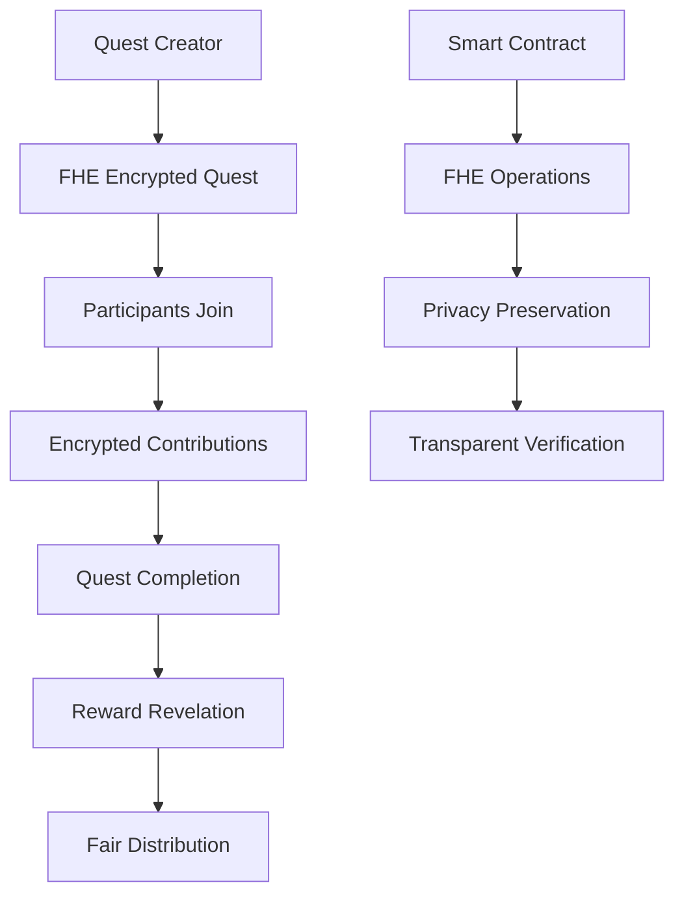

# ⚔️ Quest Sealed Rewards

> **A Revolutionary Decentralized Quest Platform with Fully Homomorphic Encryption**

[](https://opensource.org/licenses/MIT)
[](https://vitejs.dev/)
[](https://zama.ai/)

## 🌟 What Makes Us Different?

Unlike traditional quest platforms, **Quest Sealed Rewards** leverages cutting-edge **Fully Homomorphic Encryption (FHE)** technology to ensure complete privacy and fairness in reward distribution. Your quest contributions and rewards remain encrypted until all participants complete their challenges.

### 🔐 Privacy-First Architecture

- **Zero-Knowledge Quest Participation**: Your contributions are encrypted and never revealed until completion
- **Fair Reward Distribution**: Rewards are sealed using FHE and only revealed when all participants finish
- **Transparent Yet Private**: Public verification without exposing sensitive data

## 🚀 Quick Start

### Prerequisites

- **Node.js** 18+ and npm
- **Web3 Wallet** (MetaMask, Rainbow, etc.)
- **Sepolia ETH** for gas fees

### Installation

```bash
# Clone the repository
git clone https://github.com/0xRustWizard/quest-sealed-rewards.git

# Navigate to project directory
cd quest-sealed-rewards

# Install dependencies
npm install

# Start development server
npm run dev
```

### Environment Setup

Create a `.env.local` file:

```env
# Chain Configuration
NEXT_PUBLIC_CHAIN_ID=11155111
NEXT_PUBLIC_RPC_URL=https://sepolia.infura.io/v3/YOUR_INFURA_KEY

# Wallet Connect
NEXT_PUBLIC_WALLET_CONNECT_PROJECT_ID=YOUR_PROJECT_ID

# Optional: Infura API Key
NEXT_PUBLIC_INFURA_API_KEY=YOUR_INFURA_KEY
```

## 🏗️ Architecture Overview



## 🛠️ Technology Stack

### Frontend
- **⚡ Vite** - Lightning-fast build tool
- **⚛️ React 18** - Modern UI framework
- **🎨 Tailwind CSS** - Utility-first styling
- **🔗 RainbowKit** - Wallet connection made simple
- **📡 Wagmi** - React hooks for Ethereum

### Smart Contracts
- **🔒 Solidity 0.8.24** - Smart contract language
- **🔐 Zama FHE** - Fully homomorphic encryption
- **🌐 Sepolia Testnet** - Ethereum test network
- **⚒️ Hardhat** - Development framework

### Infrastructure
- **☁️ Vercel** - Frontend deployment
- **🔧 TypeScript** - Type-safe development
- **📦 npm** - Package management

## 🎮 How It Works

### 1. Quest Creation
Quest organizers create encrypted quests with sealed reward pools using FHE technology.

### 2. Participant Registration
Users connect their wallets and join quests with encrypted contributions.

### 3. Progress Tracking
Real-time monitoring of quest completion while maintaining data privacy.

### 4. Reward Unlocking
FHE-encrypted rewards are revealed only when all participants complete the quest.

### 5. Fair Distribution
Rewards are distributed based on encrypted participation data.

## 🔧 Development

### Smart Contract Development

```bash
# Compile contracts
npm run compile

# Deploy to Sepolia
npm run deploy

# Deploy locally
npm run deploy:local
```

### Frontend Development

```bash
# Start dev server
npm run dev

# Build for production
npm run build

# Preview production build
npm run preview
```

## 📚 Documentation

- **[Deployment Guide](./VERCEL_DEPLOYMENT.md)** - Deploy to Vercel
- **[Contract Guide](./CONTRACT_DEPLOYMENT.md)** - Deploy smart contracts
- **[Project Summary](./PROJECT_SUMMARY.md)** - Complete project overview

## 🤝 Contributing

We welcome contributions! Please see our contributing guidelines:

1. **Fork** the repository
2. **Create** a feature branch (`git checkout -b feature/amazing-feature`)
3. **Commit** your changes (`git commit -m 'Add amazing feature'`)
4. **Push** to the branch (`git push origin feature/amazing-feature`)
5. **Open** a Pull Request

### Development Guidelines

- Follow TypeScript best practices
- Write comprehensive tests
- Update documentation
- Ensure FHE operations are secure

## 🔒 Security

### FHE Implementation
- All sensitive data encrypted using Zama FHE
- Zero-knowledge proof verification
- Privacy-preserving computations
- Secure multi-party protocols

### Smart Contract Security
- Access control mechanisms
- Reentrancy protection
- Input validation
- Event logging for transparency

## 📊 Roadmap

- [ ] **Multi-chain Support** - Expand to other networks
- [ ] **Advanced Quest Types** - More quest categories
- [ ] **Reputation System** - Enhanced user reputation
- [ ] **Mobile App** - Native mobile experience
- [ ] **Governance Token** - Community governance
- [ ] **API Integration** - Third-party integrations

## 🌍 Community

- **Discord**: Join our community discussions
- **Twitter**: Follow for updates
- **GitHub**: Contribute to the project
- **Documentation**: Read our guides

## 📄 License

This project is licensed under the **MIT License** - see the [LICENSE](LICENSE) file for details.

## 🙏 Acknowledgments

- **Zama** for FHE technology
- **Rainbow** for wallet integration
- **Vercel** for deployment platform
- **Open source community** for inspiration

## ⚠️ Disclaimer

This project is in **beta** and should be used for testing purposes only. Always verify smart contracts before interacting with them on mainnet.

---

**Built with ❤️ by the Quest Sealed Rewards Team**

*Revolutionizing quest platforms with privacy-preserving technology*